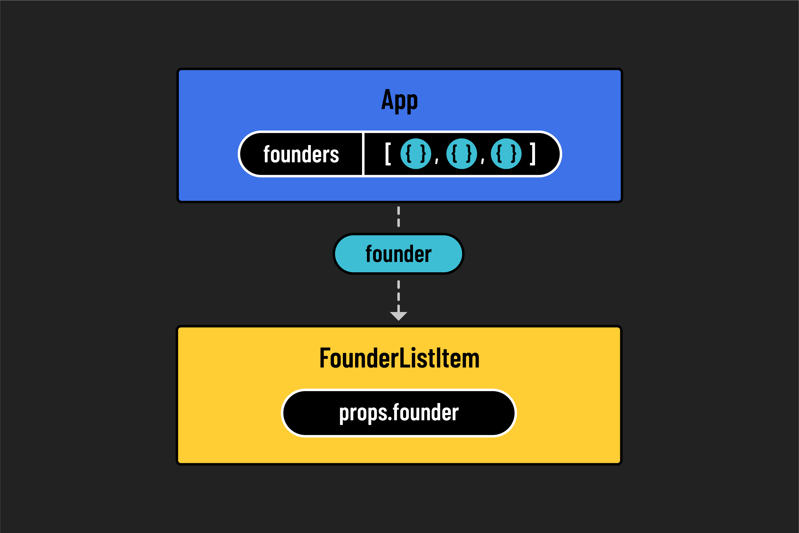

<h1>
  <span class="headline">React Components</span>
  <span class="subhead">Mapping Components with Data</span>
</h1>

**Learning objective:** By the end of this lesson, students will be able to pass data to a component inside of a `map()` array method.

## Mapping data to components



So far, we’ve seen that we can reuse React components, but we’ve been doing it manually. What if we had a list of data stored as an array of objects — which is common when working with data from a database — and wanted to create a new `FounderListItem` component for each object in that array?

This would make our components more dynamic and reduce the amount of code we need to write.

Start by copying the following `founders` array into your `App.jsx` file:

```javascript
// src/App.jsx

const founders = [
  {
    name: 'Elizabeth Holmes',
    title: 'CEO',
    credential: 'MBA from SuperLegit University',
    id: 1,
  },
  {
    name: 'Sam Bankman-Fried',
    title: 'CFO',
    credential: 'CPA from TotallyReal State',
    id: 2,
  },
  {
    name: 'Matt Damon',
    title: 'CMO',
    credential: 'Was in that movie you saw',
    id: 3,
  },
];
```

With our data ready, we can use the `map()` method to transform this array into a new list of JSX elements. Notice that each object has a unique `id`, which will help us assign a `key` to each component.

Here’s how we can update `App.jsx` to render a mapped list of `FounderListItem` components:

```jsx
// src/App.jsx

const App = () => {
  const founders = [
    {
      name: 'Elizabeth Holmes',
      title: 'CEO',
      credential: 'MBA from SuperLegit University',
      id: 1,
    },
    {
      name: 'Sam Bankman-Fried',
      title: 'CFO',
      credential: 'CPA from TotallyReal State',
      id: 2,
    },
    {
      name: 'Matt Damon',
      title: 'CMO',
      credential: 'Was in that movie you saw',
      id: 3,
    },
  ];

  return (
    <>
      <Navbar />
      <main>
        <h1>Welcome to Hyperbo.ly</h1>
        <h2>The future is firmly in front of us!</h2>
        <p>If you can't explain it to a fifth-grader, our product does it.</p>
      </main>
      <h2>Our Founders</h2>
      <ul>
        {founders.map((founder) => (
          <FounderListItem
            key={founder.id}
            name={founder.name}
            title={founder.title}
          />
        ))}
      </ul>
    </>
  );
};
```

> ⚠️ When using `.map()` to render a list of components, always give each item a unique `key` prop. This helps React keep track of each element in the list and improves performance when the list changes.

After saving, you should now see each founder rendered to the page based on the array data. Great job!

## Consolidating our `props`

Right now, we are passing individual values from each `founder` object as separate props to the `FounderListItem` component. This works fine for a few values, but what if there were 10 or 20? It would become harder to manage.

For example:

```jsx
<FounderListItem
  key={founder.id}
  name={founder.name}
  title={founder.title}
  credential={founder.credential}
  // and more...
/>
```

Instead of passing multiple individual props, we can pass the entire `founder` object as a single prop. This makes our code easier to scale.

Here’s the updated version of the `.map()` call in `App.jsx`:

```jsx
// src/App.jsx

return (
  <>
    <Navbar />
    <main>
      <h1>Welcome to Hyperbo.ly</h1>
      <h2>The future is firmly in front of us!</h2>
      <p>If you can't explain it to a fifth-grader, our product does it.</p>
    </main>
    <h2>Our Founders</h2>
    <ul>
      {founders.map((founder) => (
        <FounderListItem
          key={founder.id}
          founder={founder}
        />
      ))}
    </ul>
  </>
);
```

Now, let’s update the `FounderListItem` component so it uses the `founder` prop:

```jsx
// src/components/FounderListItem/FounderListItem.jsx

const FounderListItem = (props) => {
  return (
    <li>
      <h3>
        Hello, I'm {props.founder.name} the {props.founder.title}!
      </h3>
    </li>
  );
};

export default FounderListItem;
```

This is much cleaner, especially if we need to add more fields later.

### 🎓 You Do

Inside the `<li>` element in `FounderListItem`, add a `<p>` tag below the `<h3>`. Display the founder's credentials inside that paragraph.
