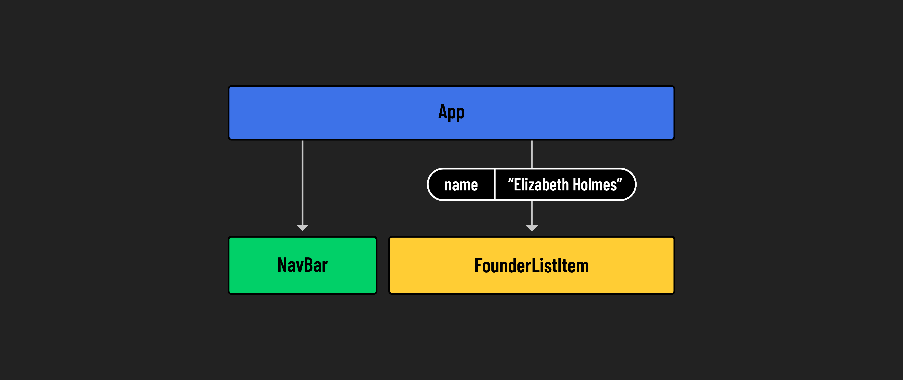
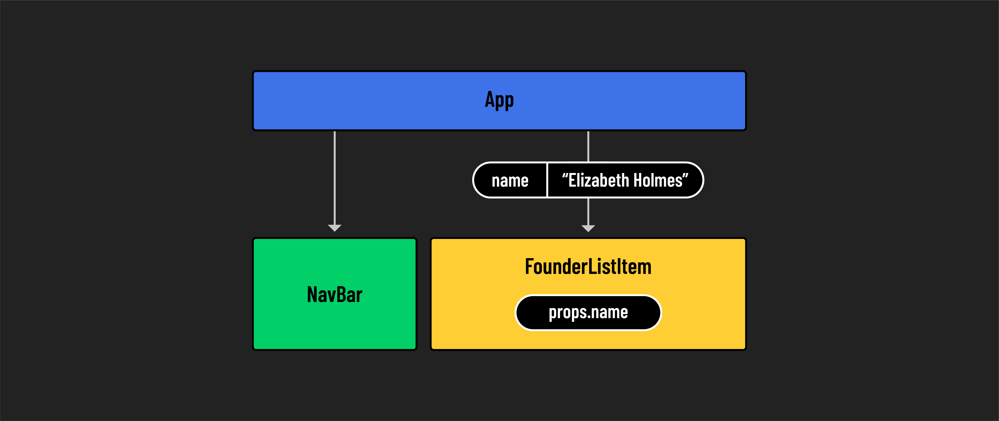

<h1>
  <span class="headline">React Components</span>
  <span class="subhead">Passing Data with Props</span>
</h1>

**Learning objective:** By the end of this lesson, students will be able to understand and implement the concept of passing data to components in React using props.

## Founders list

Components can receive data so that they're able to display it dynamically. Let's add the rest of our sample markup to our `App` component:

```jsx
// src/App.jsx

const App = () => {
  return (
    <>
      <Navbar />
      <main>
        <h1>Welcome to Hyperbo.ly</h1>
        <h2>The future is firmly in front of us!</h2>
        <p>If you can't explain it to a fifth-grader, our product does it.</p>
      </main>
      <h2>Our Founders</h2>
      <ul>
        <li>
          <h3>Elizabeth Holmes: CEO</h3>
          <p>MBA from SuperLegit University</p>
        </li>
        <li>
          <h3>Sam Bankman-Fried: CFO</h3>
          <p>CPA from TotallyReal State</p>
        </li>
        <li>
          <h3>Matt Damon: CMO</h3>
          <p>Was in that Movie You saw</p>
        </li>
      </ul>
    </>
  );
};
```

## Creating the child component

To convince investors to fund our incredible, mind-blowing AI crypto VR/AR startup, let's have the home page display a list of the fantastic founding team putting this thing together using components.

First, let's set up our child component by creating its directory and file structure. With that done, we'll add some placeholder code. There's no need to worry about passing data between these components yet. Let's just get one rendered to the page.

```bash
mkdir src/components/FounderListItem
touch src/components/FounderListItem/FounderListItem.jsx
```

```jsx
// src/components/FounderListItem/FounderListItem.jsx

const FounderListItem = () => {
  return (
    <li>
      <h3>Hello, I'm a super impressive Founder!</h3>
    </li>
  );
};

export default FounderListItem;
```

### Render our component in `App.jsx`

Import `FounderListItem` at the top of `App.jsx` and replace the first list item with the new component.

```jsx
// src/App.jsx

import Navbar from './components/Navbar/Navbar.jsx';
import FounderListItem from './components/FounderListItem/FounderListItem.jsx';

import './App.css';

const App = () => {
  return (
    <>
      <Navbar />
      <main>
        <h1>Welcome to Hyperbo.ly</h1>
        <h2>The future is firmly in front of us!</h2>
        <p>If you can't explain it to a fifth-grader, our product does it.</p>
      </main>
      <h2>Our Founders</h2>
      <ul>
        <FounderListItem />
        <li>
          <h3>Sam Bankman-Fried: CFO</h3>
          <p>CPA from TotallyReal State</p>
        </li>
        <li>
          <h3>Matt Damon: CMO</h3>
          <p>Was in that Movie You saw</p>
        </li>
      </ul>
    </>
  );
};
```


You should see the **Hello, I'm a super impressive Founder!** text on your page now. Let's make this component more interesting by passing some data to it!

## Enter props

Every React component is essentially a JavaScript function that returns JSX. When you're writing regular JavaScript functions, it's common to pass in data as an argument. So far, our React components have not been written to accept data. However, React's architecture allows data to flow from parent to child components using *props* (short for properties).

Props are the information that you pass to a JSX tag. They help pass data around an app and reinforce React's tree-like structure. Think of it as a one-way street where data travels downwards from parent to a child, a concept central to React known as ***unidirectional data flow***.

To create this structure in our existing application, we need to solve  two pieces of the puzzle: setting up a component to accept props from its parent and setting up the parent to send props down to its children.

## Passing a prop to a child component

Props are passed to child components by adding them as named attributes to the component elements in the JSX.

```jsx
// src/App.jsx

      <h2>Our Founders</h2>
      <ul>
        <FounderListItem name="Elizabeth Holmes" />
        <li>
          <h3>Sam Bankman-Fried: CFO</h3>
          <p>CPA from TotallyReal State</p>
        </li>
        <li>
          <h3>Matt Damon: CMO</h3>
          <p>Was in that Movie You saw</p>
        </li>
      </ul>
```



> 🧠 Here, we pass `name` as a prop and give it the string value `"Elizabeth Holmes"`.
>
> Props are not limited to strings. They can be any primitive data and even take the form of objects or arrays.

## Reading `props` inside child components

React components are just functions, so once a prop has been passed to a component in JSX, it's like passing an argument that can be used inside the component.

```jsx
// src/components/FounderListItem/FounderListItem.jsx

const FounderListItem = (props) => {
  return (
    <li>
      <h3>Hello, I'm {props.name}!</h3>
    </li>
  );
};
```



`props` are ***immutable***. A child component cannot change what it receives from its parent, nor can it alter the `props` of its parent or sibling components. `props` are like read-only instructions sent down from parent to child, ensuring a stable and predictable flow of data.

> 📚 Props (shorthand for properties) allow data to be passed from a parent component to a child component. They allow components to be dynamic and reusable. They are immutable, so they can only be read - they cannot be modified.

### 🎓 You Do

Pass another prop to the `FounderListItem` component called `title`. Give it the value of `"CEO"`. Then, make use of it in the `FounderListItem` component so that the output of the component is:

**Hello, I'm Elizabeth Holmes, the CEO!**
